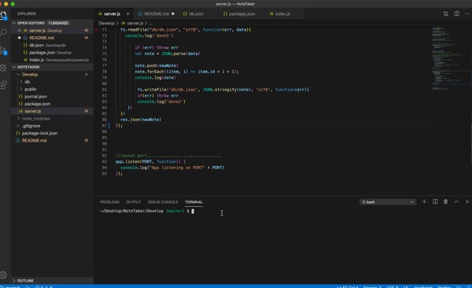

# NoteTaker

## Demo
 

## Instructions

There are a couple dependencies that are have already been provided for you in the package json. All you need to do is open your terminal and run "npm install". This gives you access to the packages that will run the applicaiton, mainly the express.js package. Next, in terminal run "node server.js". This will launched your local host 3000. You can then navigate to your browser and go to https://localhost:3000 where you will be able to start taking and editing notes.


 
## Technologies Used
- Express.js - Used for applicatoin end points handling client requests as well as utilizing middle ware for referencing public files in backend funcitions. 
- Node.js - Used for package managment and to execute JavaScript code outside of a browser to build command line tool for server-side scripting.
- Javascript - Used to base functionality of functions and prompts within the application.
- ES6 - Used to build prompts, functions, methods, and classes.  
- HTML - Used to generate HTML to be displayed in the browser.
- CSS - Used to style html elements.
- Git - Version control system to track changes to source code
- GitHub - Hosts repository that can be deployed to GitHub Pages
 
## Code Snippet

```js
app.delete('/api/notes/:id', function (req, res) {
  
  var chosenNote = req.params.id
  console.log(chosenNote)

  fs.readFile("db/db.json", "utf8", function (err, data) {
      console.log('delet1')
      if (err) throw err

      var note = JSON.parse(data)
      var index = parseInt(chosenNote) - 1
      note.splice(index, 1);

      fs.writeFile('db/db.json', JSON.stringify(note), 'utf8', function (err) {
      if (err) throw err
      console.log('deletedone2')
      })
  })
  res.send(chosenNote)
});

```

## Built With
* [Express.js](https://expressjs.com/)
* [Node.js](https://nodejs.org/en/)
* [npmjs](https://docs.npmjs.com/)
* [HTML](https://developer.mozilla.org/en-US/docs/Web/HTML)
* [CSS](https://developer.mozilla.org/en-US/docs/Web/CSS)
* [Boostrap](https://getbootstrap.com/)

## Authors

**Chris Melby**
- [LinkedIn](https://www.linkedin.com/in/chris-melby-71106b126/)
- [Link to Github](https://github.com/cmelby)
- [Portfolio](https://cmelby.github.io/portfolio/)
